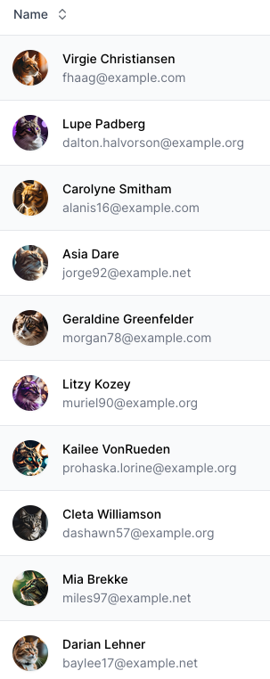

# Catz

Cat image faker for PHP.


## Introduction

FakerCatz is a lightweight PHP package designed to generate fake cat images that can be used for a variety of purposes, like avatars and other placeholders.

All images are 1024*1024 60% quality JPEGs, resulting in 50-130KB per image.




## Repositories

[Imagez](https://github.com/bradietilley/faker-imagez) available:

- [Catz](https://github.com/bradietilley/faker-catz) You are here.
- [Dogz](https://github.com/bradietilley/faker-dogz)
- [Foodz](https://github.com/bradietilley/faker-foodz)


## Installation

```
composer require bradietilley/faker-catz
```


## Documentation

The documentation for this is the same as the base [Imagez](https://github.com/bradietilley/faker-imagez) documentation, except instead of `imagez()` you'll need to use `catz()`.


**Quick example:**

```php
catz()->path();                             // string path: /path/to/pics/cat_0037.jpg
catz()->path();                             // string path: /path/to/pics/cat_0101.jpg
catz()->all();                              // array of string paths
```


## Author

- [Bradie Tilley](https://github.com/bradietilley)
